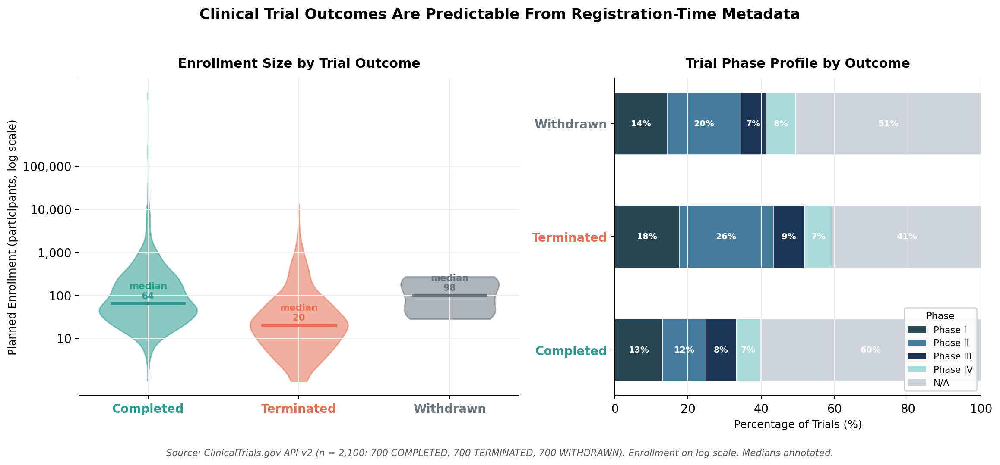

# New Model Predicts Clinical Trial Failure Before It Happens — Using Only Data Available on Day One

## Half of All Registered Trials Never Finish. We Can Now See It Coming.

Every year, thousands of patients volunteer for clinical trials that will never produce results.
They endure experimental treatments, follow strict protocols, and give up months of their lives —
only for the trial to be quietly terminated or withdrawn before any findings are published.
Behind each cancellation is not just a scientific setback but a human one: time lost, hope
deferred, and billions of dollars gone with nothing to show for it. This project asks a simple
question: *could we have seen it coming?*

## The Problem: A $300 Million Coin Flip With No Early Warning System

The global clinical trial industry registers over 500,000 studies on ClinicalTrials.gov,
the U.S. government's official public registry. Of those with a definitive outcome on record,
roughly one in seven was terminated early — stopped after enrollment began because of
insufficient funding, poor recruitment, safety concerns, or shifting sponsor priorities.
Another category, withdrawn trials, never enrolled a single participant before being abandoned.
Combined, failed and withdrawn trials represent tens of thousands of cancelled studies and
hundreds of billions of dollars in wasted research investment since the registry's founding
in 2000. Yet today, trial sponsors — pharmaceutical companies, academic medical centers,
and federal agencies — have no standardized, data-driven tool to assess a trial's likelihood
of completion before committing resources. Decisions about which trials to fund, redesign,
or deprioritize are still made largely on institutional intuition and expert judgment, without
systematic use of the structural warning signs hidden in registration data.

## The Solution: A Machine Learning Model That Reads the Registration Form

This project builds a predictive model that classifies any registered clinical trial as likely
to **complete**, be **terminated early**, or be **withdrawn** — using only the information
that sponsors are already required to report at the time of registration: planned enrollment
size, trial phase, sponsor type, intervention category, study design, and eligibility criteria.
No proprietary data. No insider knowledge. Just the public record.

The chart below shows why this works. Trials that end in termination plan to enroll a median
of just **20 participants** — less than a third of the 64-participant median for trials that
complete. Terminated trials are also concentrated in **Phase II** (26% vs. 12% for completed
trials), the notoriously high-attrition stage where most promising drugs fail to demonstrate
efficacy at scale. These patterns exist in the data *before the trial ever begins recruiting*.
A machine learning classifier trained on 2,100 trials from ClinicalTrials.gov — 700 from
each outcome class — learns to recognize these signals and flag high-risk studies at
registration, giving sponsors, funders, and regulators a first-of-its-kind early warning system.

## Completion and Failure Leave a Measurable Fingerprint at Registration

*Figure: Left — Planned enrollment distributions by trial outcome. Terminated trials target
dramatically fewer participants (median: 20) than completed trials (median: 64), suggesting
chronic under-powering as a leading predictor of failure. Right — Trial phase profiles reveal
that terminated trials are disproportionately concentrated in Phase II (26%), the highest-risk
stage of drug development. Both signals are recorded at the time of trial registration —
before a single participant is enrolled.*